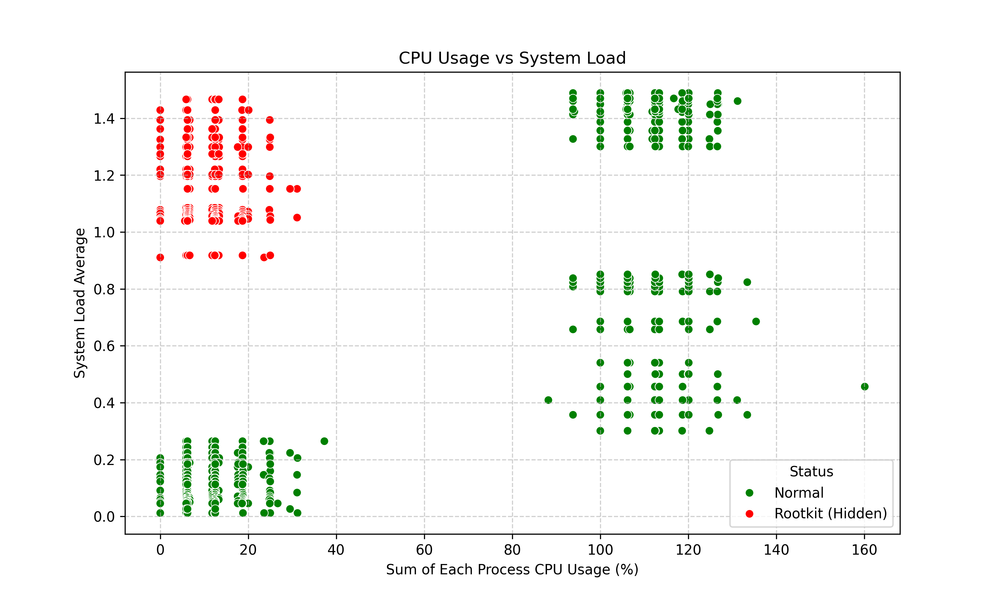
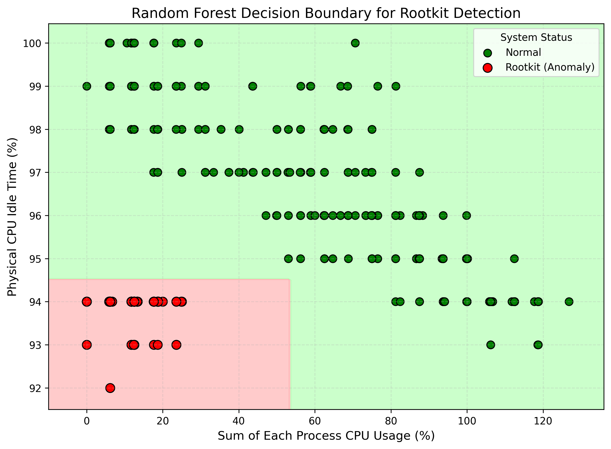
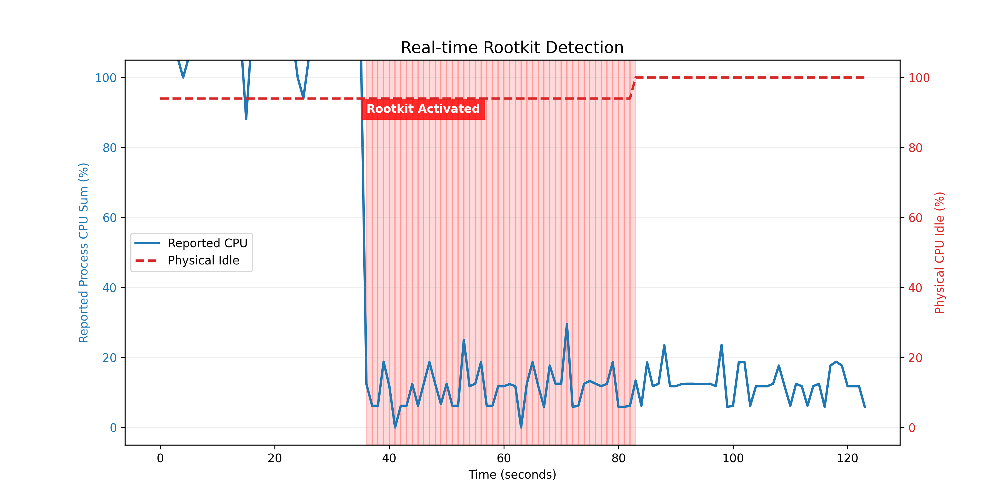

# rootkit_detector
A tool for training models to detect rootkits hiding CPU-intensive processes.

## Prepare virtual environment
```
python3 -m venv .
bin/activate
```

## Collect data to store in sys_metrics.csv
You should prepare both normal data (CPU idling and high-CPU-consumption process running) and abnormal data (high-CPU-consumption process running with rootkit).
```
python3 collect.py
```

## Train a Random Forest model using the data from sys_metrics.csv
```
python3 train.py
```

## Detect anomalies to identify the presence of rootkits in the OS by load_detector.pkl model
```
python3 detect.py
```

## Visualization
- Feature Scatter Plot
```
python3 visualization/gen_feature_scatter_plot.py
```

- Decision Boundary Map
```
python3 visualization/gen_decision_boundary.py
```

- Real-time Detection Timeline
```
python3 visualization/gen_realtime_detection.py
```


